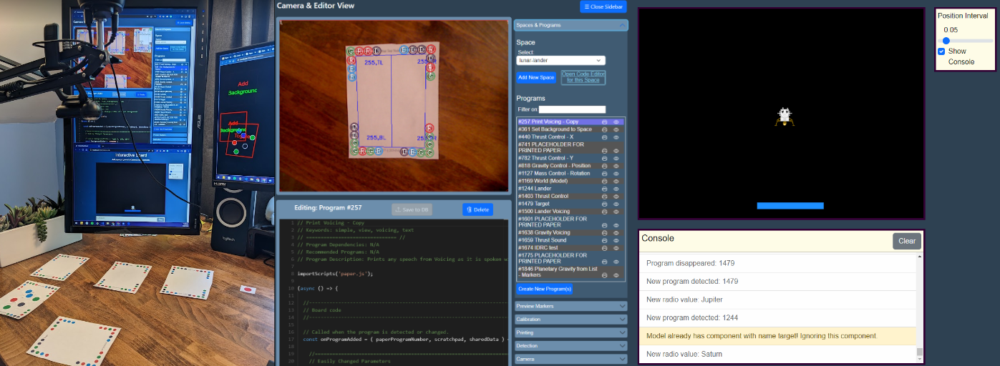
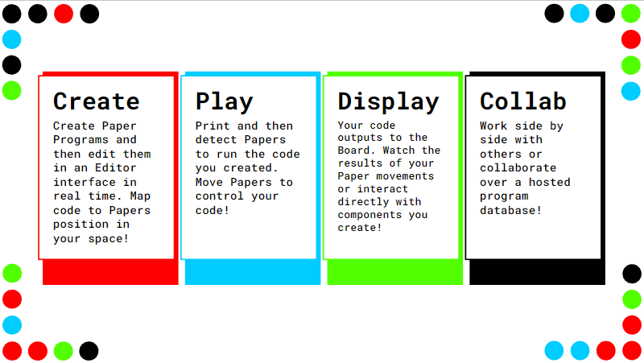

<!-- https://squidfunk.github.io/mkdocs-material/reference/admonitions/#supported-types -->
!!! warning "Under Construction"

    We are constantly working on updating our documentation!
# Paper Playground

## Interactive Play Meets Multimodal Web Development

Paper Playground is an open-source project for collaboratively creating multimodal web experiences by means of mapping JavaScript code to real pieces of paper and manipulating the code in your **physical space**.

We aim to support a community interested in bringing physical interaction as a means to collaboratively solve problems in codesigning technology.

Paper Playground is based on the [Paper Programs](https://paperprograms.org) open-source project and has been extended to incorporate [the library stack](https://github.com/scenerystack) used by [PhET Interactive Simulations](https://phet.colorado.edu) as a robust 2D scene creator and manager. The project focuses on enabling quick prototyping of web projects using JavaScript, with a particular emphasis on easy addition of audio features (like sounds and sonifications), speech description (both TTS engines and screen reader descriptions), and other non-visual features that are often difficult to design and develop alongside visual elements in these projects.

The ideas behind Paper Playground are simple, but the possibilities are infinite.

1. Create programs, as many as you would like, to represent your project.
2. Print out the dot-covered papers that belong to those programs.
3. Put those *paper programs* in front of a webcam.
4. Watch and interact with the output of that code in your browser.
5. Move programs around and trigger the mappings between your papers position in space and your code!
6. Change your program code and keep the creativity going!

<figure markdown>
  { width=900 }
  <figcaption>The interface in action.</figcaption>
</figure>

## What can you do with it?

<figure markdown>
  { width=600 }
  <figcaption></figcaption>
</figure>

You'll create JavaScript programs to populate a page (Board) with interactive, multimodal components to envision anything you want!

Want to create a simple game? Maybe an interactive art experience? Or maybe you want to prototype auditory displays (speech and sounds) for a project or idea that you have? It's all possible with Paper Playground.

Every program you write is associated with a sequence of colored (black, red, green, and blue) dots that you will put (or print) on the corners of a piece of paper. We'll refer to the linked papers and code as paper programs from here on out!

<figure markdown>
<iframe width="560" height="315" src="https://www.youtube.com/embed/5-GzrdAAva8" title="YouTube video player" frameborder="0" allow="accelerometer; autoplay; clipboard-write; encrypted-media; gyroscope; picture-in-picture; web-share" allowfullscreen></iframe>
  <figcaption></figcaption>
</figure>

!!! note
    This project retains the features of [Paper Programs](https://paperprograms.org). Refer to [Paper Programs documentation](https://github.com/janpaul123/paperprograms/blob/master/docs/) regarding legacy features (*including writing code for output to Projector*).

### What do I do now? How do I create programs, detect programs, set up my camera and space, and make things happen?

See Setup section for installation and device setup instruction. See Documentation section for information on creating and using paper programs.

| Setup      | Documentation |
| ----------- | ----------- |
| [Installation](./setup/install.md)          | [Tutorial](./use/tutorial.md)                      |
| [Device Setup](./setup/device-setup.md)     | [Board API Documentation](./use/board-api.md)      |
| [Device Recommendations](./setup/reqs.md)   | [Example Paper Programs](./use/example-program.md) |
| [Camera Setup Tips](./setup/camera-tips.md) | [Model-View-Controller Framework](./use/mvc.md)    |
|                                             | [Resources and Downloads](./use/resources.md)      |

## What is coming?

Our team is focused on a few large initiatives for integrating other projects into Paper Playground and for making it more friendly for non-technical, non-JavaScript users and designers. If these projects interest you, please join our community and take part in the development and discussion!

1. :robot: Using LLMs to support a user answer the question: "How do I turn my idea for a multimodal interactive into data variables, functions, and entire programs?". We are exploring generative models to support user creativity and engage iteratively toward outputting the full suite of programs for their project.

2. :unlock: Abstracting the JavaScript code through means of an interface that assembles the components of your programs and highlights the relationships between your programs (e.g., At a quick glance, what information is needed and passed between programs?).

3. :outbox_tray: Easier API integration for paper programs to control or output to other browser displays (besides our [scenery](https://github.com/phetsims/scenery)-focused Board and the legacy canvas-focused Projector), as well as new inputs such as microcontroller integration via Bluetooth and WebSockets.

However, there are **many other areas** that the project can be expanded (see below for Contributing guidelines and suggestions)!

## Please, join our [Community](/docs/community.md)

## Roadmap

### Docs

:books:  Updated setup and tutorial!

### Tool

:page_with_curl:  More examples in the hosted database highlighting the power of multimodal design!

:computer:  A UI for creating basic Papers without deep JavaScript knowledge!

:robot: Investigating use of LLMs to help users go from ideas to your suite of paper programs!

## License

This software is licensed under the MIT license. For more information, see the [LICENSE](https://github.com/phetsims/paper-land/blob/main/LICENSE) file.
