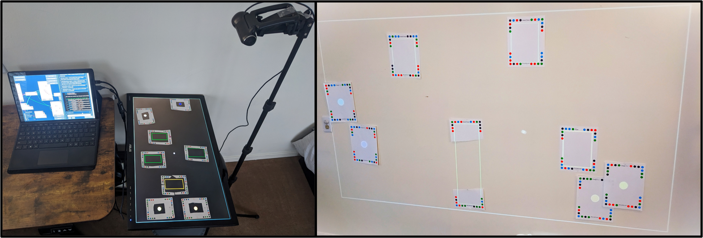
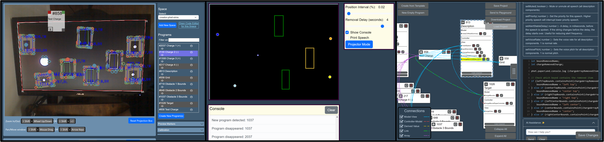

# Welcome to Paper Playground: Your Interactive Design Space

Paper Playground is an open-source project for collaboratively creating multimodal web experiences by means of mapping code to real pieces of paper and manipulating the code in your **physical space**. Everything runs on your machine and you can collaborate locally or using a hosting service to collaborate over projects with others in your shared space.

While Paper Playground can support many uses, our aim to support a community interested in bringing physical interaction as a means to collaboratively solve problems in codesigning technology.

Paper Playground is based on the [Paper Programs](https://paperprograms.org) open-source project and has been extended to incorporate [SceneryStack](https://github.com/scenerystack), the development stack used by [PhET Interactive Simulations](https://phet.colorado.edu) as a robust 2D scene creator and manager. The project focuses on enabling quick prototyping of web projects based in JavaScript. In creating Paper Playground, we are developing with a particular emphasis on easy addition of multimodal display such as audio features (like sounds and sonifications), speech description (both TTS engines and screen reader descriptions), and other non-visual features that are often difficult to design and develop alongside visual elements in complex web projects. Learn more on the [Multimodal Codesign page](./projects/codesign.md).

### Overview of Paper Playground Components

Paper Playground is built around a few key components that work together seamlessly:

- **Program Creation Systems**: Design and iterate on your programs with ease using abstracted program components in *Creator*.
- **Computer Vision**: Our tool detects your dot-encoded paper programs using a webcam, merging the digital and physical realms.
- **Execution and Display**: See your code come to life on screen, with outputs displayed in real-time.
- **Collaboration**: Shared databases allow for asynchronous collaboration, whether you’re working locally or online.

<figure markdown>
  
  <figcaption>Flexible configurations for detecting paper programs and interacting with your code!</figcaption>
</figure>

You’ll interact with Paper Playground through three main interfaces:

1. ***Camera***: Detects your paper programs using an attached camera device.
2. ***Interactive Display***: Shows the results of your programs, which can be interacted with virtually or projected.
3. ***Creator***: A low-code interface where you design your programs, step by step.

### Getting Started with Your Design

Check out the Getting Started section in the Navigation bar! We recommend reading the [Hardware Recommendations](./setup/reqs.md) first. In general, you will:

1. [**Set Up Your Workspace**](./setup/device-setup.md#setting-up-camera-and-projector-for-paper-detection): Open your interfaces. The Interactive Display can be set up on a separate monitor or projector, showing dot-encoded papers.
2. [**Calibrate the *Camera***](./setup/device-setup.md#color-calibrating-your-webcam-for-program-detection): Attach a webcam and adjust it according to your lighting conditions to ensure your dot-encoded papers are detected accurately.
3. [**Design with *Creator***](./setup/creator.md): Build your programs component by component, aligning with your creative vision. Each program gets a unique identity and sequence of dots for easy detection and interaction.

<figure markdown>
  
  <figcaption>Interfaces for Paper Playground: (Left) program detection and play area, Camera. (Middle) Code output and projection, Interactive Display. (Right) Program editor, Creator.</figcaption>
</figure>

**Bringing Paper Programs to Life**. After designing, print your paper programs. These can be detected by the *Camera* once in view, executing the associated code. Interact with your creations on the Interactive Display, manipulating papers to trigger events that dynamically update program components and outputs.

**Dynamic and Collaborative Design**. Paper Playground supports an iterative design process. Make real-time updates in the *Creator* interface, see changes immediately on the Interactive Display, and collaborate with co-designers to refine your projects. This cycle encourages continuous creativity and improvement.

**Enhancements for Inclusivity and Interaction**. Leveraging the open-source SceneryStack libraries, Paper Playground supports multimodal features like sound, pan and zoom, and alternative input. This makes your projects more accessible and interactive, enhancing the creative experience.

**Flexible and Creative Setup Options.** Your paper programs can be any size, cut, folded, or decorated, allowing for diverse and flexible setup configurations. Whether you’re working with a desktop setup or projecting onto a wall, Paper Playground adapts to your creative environment.

Paper Playground invites you to explore the boundaries of interactive design and collaboration. Whether you’re crafting educational tools, art installations, or experimental projects, this platform offers a unique space for your creativity to flourish. Start designing, collaborating, and seeing your ideas come alive in an interactive, dynamic environment.

<figure markdown>
  
  <figcaption>Papercraft submarine controlling a virtual submarine!</figcaption>
</figure>

## Community

[🌍 Join the Community 🌍](community.md){ .md-button .md-button--primary }

## License

This software is covered under the [MIT License](https://github.com/phetsims/paper-land/blob/main/LICENSE).

!!! note
    This project retains the features of [Paper Programs](https://paperprograms.org). Refer to [Paper Programs documentation](https://github.com/janpaul123/paperprograms/blob/master/docs/) regarding legacy features (*including writing code for output to Projector*).
