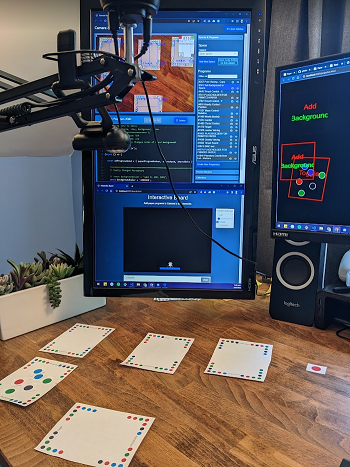

# Paper Playground 

<!-- https://squidfunk.github.io/mkdocs-material/reference/admonitions/#supported-types -->
!!! warning "Under Construction" 
      
    We are working on updating our documentation - more details coming soon!

<!-- Uses md_in_html markdown extension -->
<figure markdown>
  { width=300 }
  <figcaption></figcaption>
</figure>

## Augmented Reality Meets Multimodal Web Design

Paper Playground is an open-source tool for collaboratively designing multimodal web interactions by mapping JavaScript code to real pieces of paper and manipulating them in your physical space. It is based on the [Paper Programs](https://paperprograms.org) open-source project and has been extended to incorporate the API used by [PhET Interactive Simulations](https://www.github.com/phetsims/). The tool focuses on enabling quick prototyping of web projects using JavaScript, with a particular emphasis on easy addition of audio features (like sounds and sonifications), speech description (both TTS engines and screen reader descriptions), and other non-visual features that are often difficult to design and develop alongside visual elements in these projects.

The primary purpose of Paper Playground is to enable expert developers and designers to rapidly iterate on stakeholder's ideas, especially when co-designing with non-technical stakeholders who have valuable feedback but no expertise to implement their ideas in real-time. By using Paper Playground, developers and designers can create inclusive and joyful web experiences by seamlessly weaving visuals, sounds, spoken descriptions, and other inputs and displays.

<figure markdown>
  { width=400 }
  <figcaption></figcaption>
</figure>

## What can you do with it?

This repository is dedicated to retaining the features of [Paper Programs](https://paperprograms.org). For the most accurate documentation regarding legacy features (*including writing code for output to Projector*), refer to the [wonderful Paper Programs documentation](https://github.com/janpaul123/paperprograms/blob/master/docs/).

### What do I do now? How do I create programs, detect programs, set up my camera and space, and make things happen?

For detailed answers to these questions and more helpful information on creating papers and delightful multimodal web experiences, please refer to our [Paper Playground Docs](https://phetsims.github.io/paper-land).

## Join our Community! 

- Make a post in the [Discussions tab](https://github.com/phetsims/paper-land/discussions/)
<!-- - Join us on our [Matrix Space](https://matrix.to/#/#interactive-paper-programming:matrix.org) -->
- [Contribute to the project](https://phetsims.github.io/paper-land/CONTRIBUTING/) (code, ideas, documentation, paper program examples, anything!)
<!-- - Join our open design meetings (Tuesdays from 12:00-13:00 Eastern Time). Find the zoom link in our Matrix Design channel. -->
- Have a great idea for how you or your community might connect to Paper Playground? Reach out to brett dot fiedler at colorado dot edu to discuss opportunities!

## Coming soon

### Docs
:books: Updated setup and tutorial!

:camera: Pictures and demos of Paper Playground in action!

:construction: A better Roadmap than this!

### Tool
:page_with_curl: More examples in the hosted database highlighting the power of multimodal design!

:computer: A GUI for creating basic Papers without deep JavaScript knowledge!

## License

This software is licensed under the MIT license. For more information, see the [LICENSE](https://github.com/phetsims/paper-land/blob/master/LICENSE) file.

<!-- Features
If Paper Playground has specific features that set it apart or provide unique functionality, you can include a section that highlights these features. For example, if it supports real-time collaboration or has a comprehensive library of pre-built components, you can describe those features in this section.

Demo or Screenshots
Including a section with a demo or screenshots can provide visual context and help users understand the capabilities of Paper Playground. You can showcase examples of paper prototypes created using the tool or provide screenshots of the user interface.

Roadmap
If you have a roadmap for the future development of Paper Playground, it can be useful to share it with users and contributors. This section can outline upcoming features, improvements, or bug fixes that you plan to work on.

Dependencies
If there are specific dependencies or external libraries that Paper Playground relies on, it can be helpful to list them in a dedicated section. Provide instructions on how to install or set up these dependencies if necessary.

API Documentation
If Paper Playground has an API that developers can utilize, you may consider providing API documentation. This can include details about available endpoints, request/response examples, and authentication mechanisms.

Troubleshooting or FAQs
Including a section with common troubleshooting tips or frequently asked questions can assist users in resolving common issues. Provide solutions to known problems or direct users to relevant resources such as forums or support channels. -->