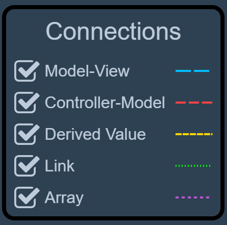
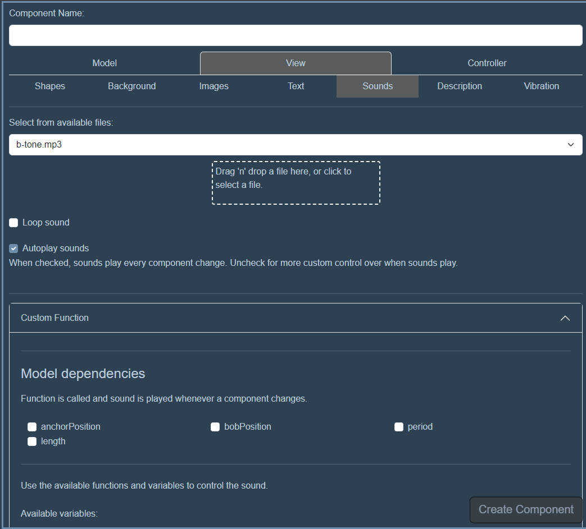
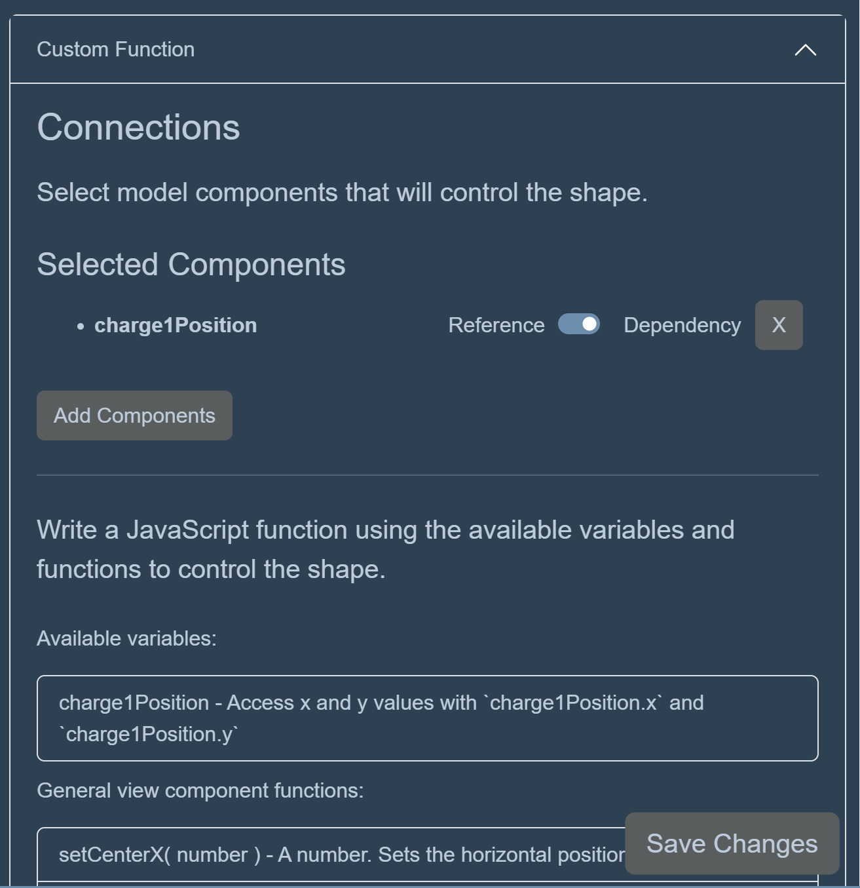
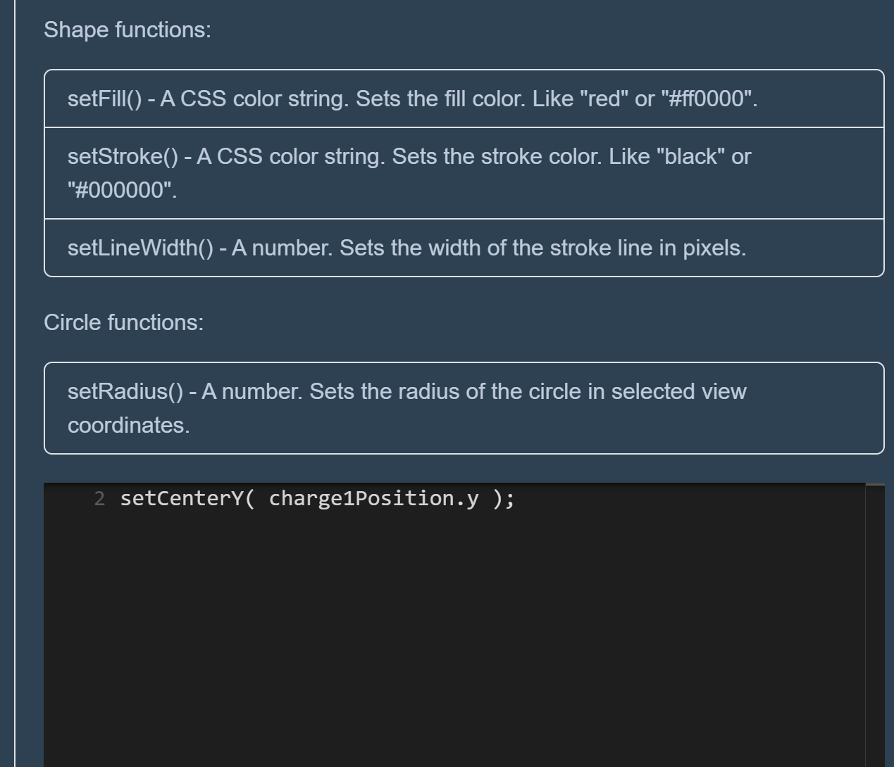
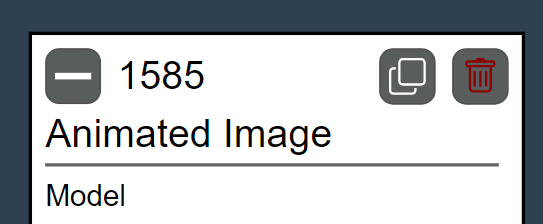
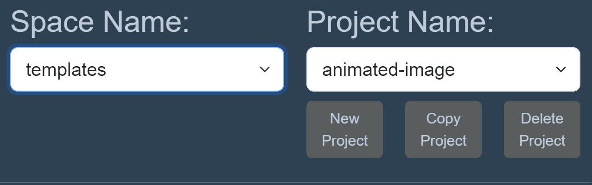
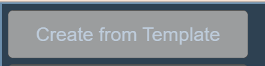
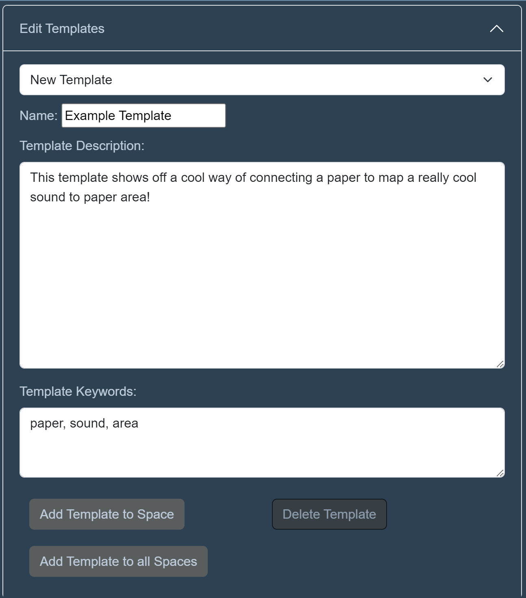

# Creator Tutorial

!!! warning "Under Construction"

      We are working on updating our documentation - more details coming soon!
      
## What is Creator?

!!! warning "In Development"

      The Creator interface is in development! The current feature set likely does not reflect the final vision of the tool. Follow the development in [GitHub](https://github.com/phetsims/paper-land) or in our community channels!

Creator is where you will add code to your paper programs before printing and playing with them in the *Camera*! The primary vision of Creator is to bring the relationships between the components of your project to the forefront, with significantly less code than using pure JavaScript. The goal is to let you focus on the most important pieces and how they connect to your chosen interactions and outputs (sounds, speech, images, etc). Making programs in Creator is organized around the Model-View-Controller (MVC) software design pattern.

### What is MVC?

MVC stands for [Model-View-Controller](../use/mvc.md), a design pattern that divides your program into three interconnected components:

- **Model**: This is the heart of your application, managing the data and logic. Think of it as the brain that knows everything but doesn't show anything.
- **View**: The View is all about presentation and user interface. It takes information from the Model and displays it in a way that you can understand and interact with.
- **Controller**: Acting as a bridge between you and the system, the Controller interprets user inputs and interactions, then decides what to do with them.

This separation makes it easier to manage complex interactions, especially when changes in one area need to reflect in others.

In *Creator* you will **create programs**: Just like laying out papers on a desk, you can create, organize, and iterate on your programs within the *Creator* interface. Each program is like a piece of paper that you can move, collapse, or duplicate. Here you'll add components to your programs:

- **Model Components**: These are the building blocks of your application's logic and data. You'll define what each component does, how it interacts with others, and how it should be controlled.
- **View Components**: Decide how your application will present data and respond to user interactions. This could be through visuals, sounds, or even speech.
- **Controller Components**: These components are all about action. They determine how user inputs modify the Model or trigger changes in the View.

### Linking to the *Camera* Interface

!!! note inline end "Hide/Show dependency connections"
      

Once your program is set up, you can link it to the *Camera* interface by pressing the "Send to Playground" button at the top right of the LEFT PANE. Head over to *Camera* and interact with your programs as physical papers. Move them around, and see how they come to life, then come back to *Creator* to make changes!

### Visualizing Relationships

To keep track of how everything is connected, **dependencies** - components that rely on each other - are connected with colorful, dashed arrows. This, optional, visual cue helps you quickly anticipate how changes in one component might affect another or note missing pieces of your programs. They are broken into several categories depending on the components connected together.

## Example *Creator* Project: Audio Pendulum

We can illustrate the way programs are created, taking the 'Audio Pendulum' project as an example. Audio Pendulum is a simple interactive portraying a pendulum bob exhibiting periodic motion around an anchor, emitting a soft tone at its lowest point.

The project utilizes several Model components: 'bobPosition' and 'anchorPosition' track the pendulum and anchor, 'period' defines the motion's frequency, and 'length' measures the distance from the bob to the anchor.

These components can be integrated into various programs. The project is designed to let users place the anchor and adjust the bob's position interactively. This setup requires two separate programs: one to map the anchor's position to a paper location, and another to set the bob's length based on its distance from another paper.

Controller components 'bobController' and 'anchorPositionController' are used to animate the bob and set the anchor's position, respectively. Additionally, View components create the visual (like circles for the bob and anchor using shape components) and auditory elements (a 'bobSound' function calculates timing of the tone trigger based on the bob's swing position).

**Watch the steps to create Audio Pendulum and the project in action in these videos:**

<figure>
   <iframe width="877" height="493" src="https://www.youtube.com/embed/9oRPWbRxbNk" title="Paper Playground - Audio Pendulum - Creator Walkthrough" frameborder="0" allow="accelerometer; autoplay; clipboard-write; encrypted-media; gyroscope; picture-in-picture; web-share" allowfullscreen></iframe>
</figure>

<figure>
   <iframe width="371" height="659" src="https://www.youtube.com/embed/18B9Z4Ch_08" title="Paper Playground - Audio Pendulum project with pieces of paper" frameborder="0" allow="accelerometer; autoplay; clipboard-write; encrypted-media; gyroscope; picture-in-picture; web-share" allowfullscreen></iframe>
</figure>

## Adding Model, View, and Controller Components to your Programs

{Content coming soon!}

### Component Details
=== "Model Components"
      There will be info on each component in here. Including Arrays and array items!

      

=== "View Components"
      There will be info on each view component in here.

      

      **Adding Images and Sounds**

      Adding your own images (.jpg, .png, .gif, etc.) and sounds (.wav, .mp3, etc.) can be done right in *Creator*! Add a View Component, select Image or Sound, and drag/drop your file or select the upload box to open a file dialog.

      Once uploaded, files will live in the paper-land directory under `.../www/media/images/upload` or `.../www/media/sound/upload`. You can also directly add files to this directory for bulk upload.

      The files will now appear in the dropdown selection for those components!

=== "Controller Components"
      There will be info on each controller component in here.

      

      ## Paper Controller Components - What can I use to trigger code in my paper programs?**

      !!! inline end tip
            For advanced users or when using Custom Code, see the [paperLand API](../use/board-api.md) for all paper events.

      ### Paper Movement

      {Content coming soon!}

      ### Paper Markers

      {Content coming soon!}

      ### Whiskers - Paper Proximity

      {Content coming soon!}

### (Custom Functions) Customizing Component Output

{Content coming soon!}

### Adding Connections (component dependencies)

{Content coming soon!}

#### Dependency or Reference?

{Content coming soon!}

## Using AI chat to create custom component logic and output

{Content coming soon!}

## Custom Code

{Content coming soon!}

## Organizing Programs

{Content coming soon!}

## Managing Projects

As mentioned in the [Tutorial](./tutorial.md#organizing-your-code-spaces-and-projects), Projects exist to organize your paper programs in *Creator* only. Sending a project "to the Playground" will *overwrite the active set of papers* for that `space`.

Think of Projects as your way of managing similar sets or variants of sets of paper programs. Perhaps you want to use it as version control? Maybe you want to aggregate sets of papers that have a theme? It's up to you. Just make sure you send the project you would like to play with to the *Camera* with Send to Playground, or you might be a bit confused when your papers do something you don't expect or nothing at all! Use the **New Project** button to get going.

We recommend using the **Copy Project** feature whenever you are looking to start a variant of an existing project (whether it is read-only or you really just don't want to break your existing project). **Note: When you create a project in the `space` you are currently in, you will need to leave the space and re-enter (or refresh the Creator page) to see it appear in the list of projects for that space.**

### Downloading and Loading Projects

{Content coming soon!}

## Using Templates

You can load in templates using the "Create from Template" button in the top left of the interface. These will create a paper or set of papers that are pre-populated with components to create the desired effect. Want a shape that will follow the position of your paper? Select the *Movable Shape* template and the required papers/components will appear, ready to be customized!

!!! warning "Note"
      At this time, all imported templates are created as new programs. If you'd like to integrate them into existing programs, import the templates into your project and use them as a reference for creating new component in your existing paper programs.

### Creating Templates

Some templates are already included in Paper Playground. However, if you'd like to use templates for common sets of programs/components, you can create them globally for all `spaces` or on a per-`space` basis. *Templates exist in their own database separately from the spaces that contain your paper programs.*

#### Creating New Templates

1. Create a new project in the space of your choice (the `templates` space is the best choice if using our hosted program database).
2. Create your programs! Populate them with the necessary components to create a self-contained fully functioning (set of) program(s).
3. Open the "Edit Templates" collapsible menu on the RIGHT PANE.
4. Make sure you have "New Template" selected from the dropdown. Selecting an existing template will overwrite the programs in the LEFT PANE!
5. Enter a name, description, and a few comma separated keywords.
6. Save the Template for globally for all `spaces` or just locally in the `space` you are currently in.
7. That's it! Check it's been created by using the "Create from Template" button.

#### Editing Templates

1. Open your template from the "Edit Templates" collapsible menu ( :danger: this will override any program you current have in the LEFT PANE!)
2. Make any changes to your programs and their components. You can also edit the Template name and description.
3. Save changes!

## More walkthroughs

### Paper Organ Walkthrough

<figure>
<iframe width="877" height="493" src="https://www.youtube.com/embed/DnZdQ917vW8" title="Paper Playground - Paper Organ - *Creator* Walkthrough" frameborder="0" allow="accelerometer; autoplay; clipboard-write; encrypted-media; gyroscope; picture-in-picture; web-share" allowfullscreen></iframe>
</figure>
