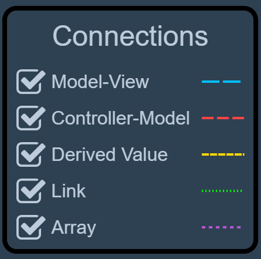
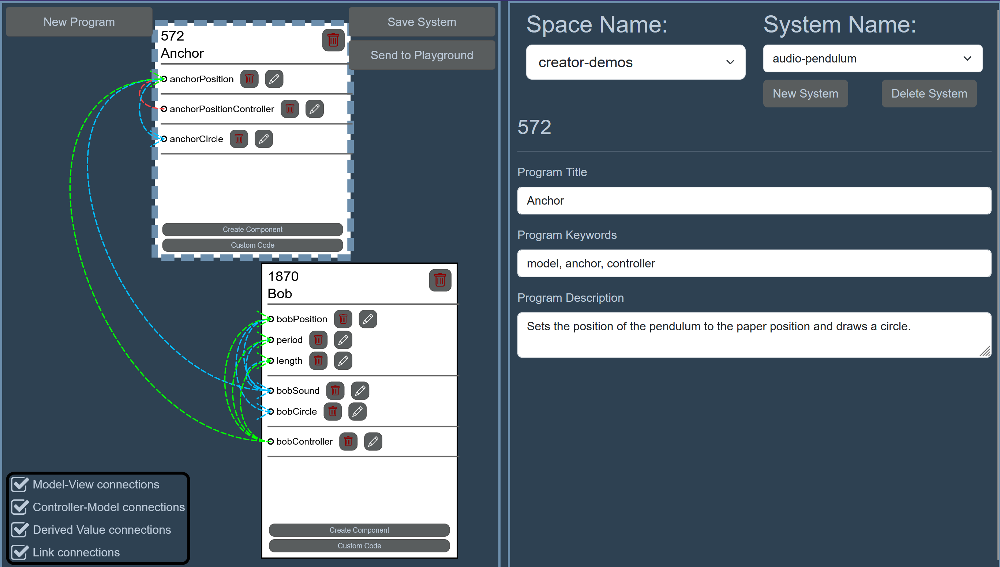
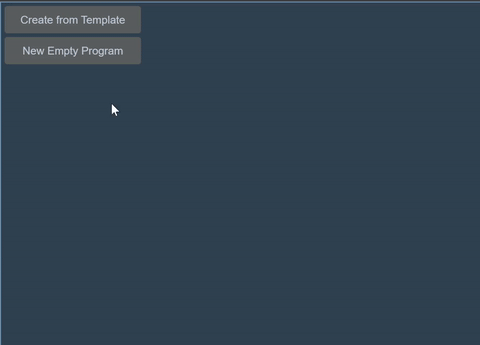
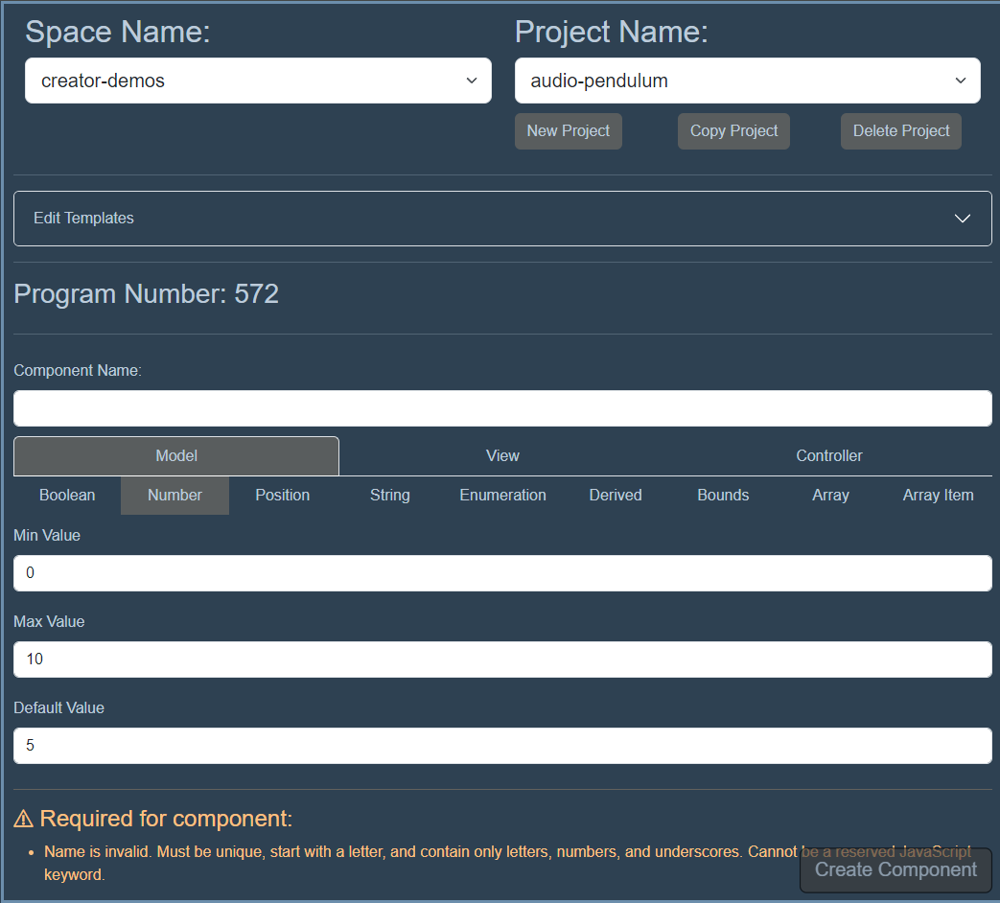
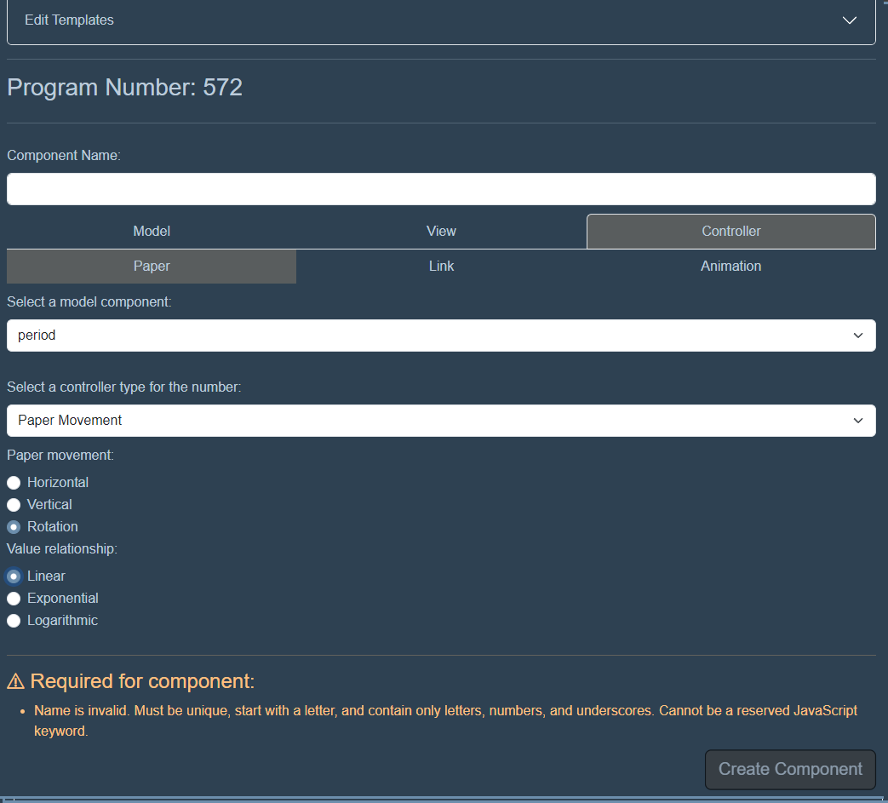
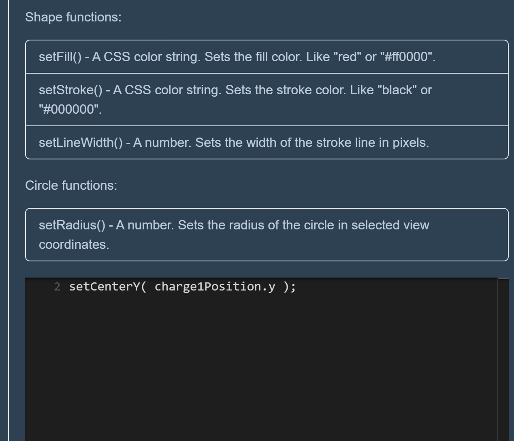
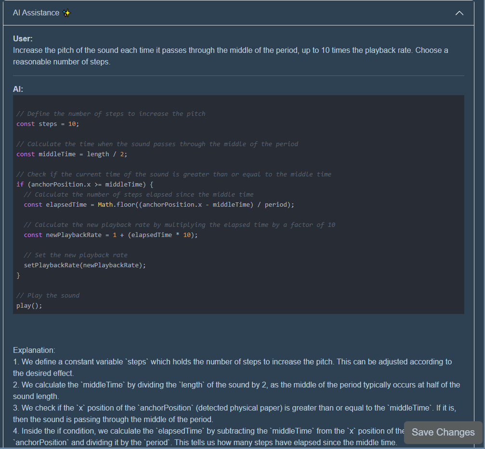
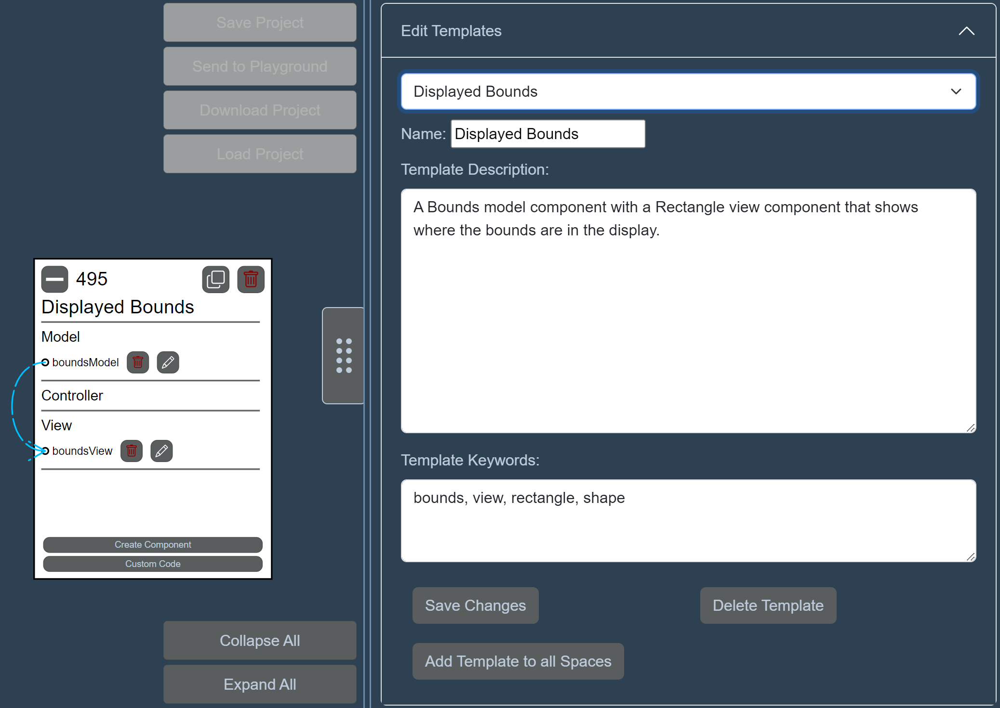

# Creator Tutorial

!!! warning "In Development"

      The *Creator* interface is in development! The current feature set is evolving and documentation may be out of date. Follow the development in [GitHub](https://github.com/phetsims/paper-land) or our [community channels](../community.md)!

## What is *Creator*?

*Creator* is where you will add code to your paper programs before printing and playing with them in the *Camera*! The primary vision of Creator is to bring the relationships between the components of your project to the forefront, with significantly less code than using pure JavaScript. The goal is to let you focus on the most important pieces and how they connect to your chosen interactions and outputs (sounds, speech, images, etc). Making programs in Creator is organized around the Model-View-Controller (MVC) software design pattern.

### What is MVC?

MVC stands for [Model-View-Controller](../use/mvc.md), a design pattern that divides your program into three interconnected components:

- **Model**: This is the heart of your application, managing the data and logic. Think of it as the brain that knows everything but doesn't show anything.
- **View**: The View is all about presentation and user interface. It takes information from the Model and displays it in a way that you can understand and interact with.
- **Controller**: Acting as a bridge between you and the system, the Controller interprets user inputs and interactions, then decides what to do with them.

This separation makes it easier to manage complex interactions, especially when changes in one area need to reflect in others.

In *Creator* you will **create programs**: Just like laying out papers on a desk, you can create, organize, and iterate on your programs within the *Creator* interface. Each program is like a piece of paper that you can move, collapse, or duplicate. Here you'll add components to your programs:

- **Model Components**: These are the building blocks of your application's logic and data. You'll define what each component does, how it interacts with others, and how it should be controlled.
- **View Components**: Decide how your application will present data and respond to user interactions. This could be through visuals, sounds, or even speech.
- **Controller Components**: These components are all about action. They determine how user inputs modify the Model or trigger changes in the View.

### Linking to the *Camera* Interface

!!! note inline end "Hide/Show dependency connections"
      

Once your program is set up, you can link it to the *Camera* interface by pressing the "Send to Playground" button at the top right of the LEFT PANE. Head over to *Camera* and interact with your programs as physical papers. Move them around, and see how they come to life, then come back to *Creator* to make changes!

### Visualizing Relationships

To keep track of how everything is connected, **dependencies** - components that rely on each other - are connected with colorful, dashed arrows. This, optional, visual cue helps you quickly anticipate how changes in one component might affect another or note missing pieces of your programs. They are broken into several categories depending on the components connected together.

## Example *Creator* Project: Audio Pendulum



We can illustrate the way programs are created, taking the 'Audio Pendulum' project as an example. Audio Pendulum is a simple interactive portraying a pendulum bob exhibiting periodic motion around an anchor, emitting a soft tone at its lowest point.

The project utilizes several Model components: 'bobPosition' and 'anchorPosition' track the pendulum and anchor, 'period' defines the motion's frequency, and 'length' measures the distance from the bob to the anchor.

These components can be integrated into various programs. The project is designed to let users place the anchor and adjust the bob's position interactively. This setup requires two separate programs: one to map the anchor's position to a paper location, and another to set the bob's length based on its distance from another paper.

Controller components 'bobController' and 'anchorPositionController' are used to animate the bob and set the anchor's position, respectively. Additionally, View components create the visual (like circles for the bob and anchor using shape components) and auditory elements (a 'bobSound' function calculates timing of the tone trigger based on the bob's swing position).

**Watch the steps to create Audio Pendulum and the project in action in these videos:**

??? abstract "Audio Pendulum - Creator Walkthrough"
      <figure>
      <iframe width="877" height="493" src="https://www.youtube.com/embed/9oRPWbRxbNk" title="Paper Playground - Audio Pendulum - Creator Walkthrough" frameborder="0" allow="accelerometer; autoplay; clipboard-write; encrypted-media; gyroscope; picture-in-picture; web-share" allowfullscreen></iframe>
      </figure>

??? abstract "Audio Pendulum - Demo Video"
      <figure>
      <iframe width="371" height="659" src="https://www.youtube.com/embed/18B9Z4Ch_08" title="Paper Playground - Audio Pendulum project with pieces of paper" frameborder="0" allow="accelerometer; autoplay; clipboard-write; encrypted-media; gyroscope; picture-in-picture; web-share" allowfullscreen></iframe>
      </figure>

## Adding Model, View, and Controller Components to your Programs

To add a component to your program, first create a program using the "New Empty Program" button. Then, on the new paper program, select the "New Component" button.

<figure markdown>



</figure>

### Component Details

??? info "Model Components"

    - **Boolean**
  
        - *Description*: Represents a property that holds a boolean value (`true` or `false`).
        - *Usage*: Used to track state that has two states, such as a toggle button being on or off.
        
        ??? example "JS Example"
            ```js
            const isVisible = new phet.axon.BooleanProperty(true);
            phet.paperLand.addModelComponent('isVisible', isVisible);
            ```

    - **Number**
        - *Description*: Holds a numerical value within a specified range.
        - *Usage*: Useful for representing quantities, scores, or any numerical parameter that needs to be constrained within a minimum and maximum value.
        
        ??? example "JS Example"
            ```js
            const score = new phet.axon.NumberProperty(0, {
            range: new phet.dot.Range(0, 100)
            });
            phet.paperLand.addModelComponent('score', score);
            ```

    - **String**
        - *Description*: Stores a string value.
        - *Usage*: Ideal for text-based data, such as user input or dynamic text content within the application.

        ??? example "JS Example"
            ```js
            const userName = new phet.axon.StringProperty('Anonymous');
            phet.paperLand.addModelComponent('userName', userName);
            ```

    - **Position (Vector2)**
        - *Description*: Represents a two-dimensional vector.
        - *Usage*: Useful for tracking positions, velocities, or any other two-dimensional vector quantities in simulations.

        ??? example "JS Example"
            ```js
            const position = new phet.dot.Vector2Property(new phet.dot.Vector2(0, 0));
            phet.paperLand.addModelComponent('position', position);
            ```

    - **Enumeration**
        - *Description*: Used for properties that can take on a set of predefined values.
        - *Usage*: Ideal for states, modes, or any other property that should be limited to a specific set of values.

        ??? example "JS Example"
            ```js
            const colorMode = new phet.axon.StringProperty('dark', {
            validValues: ['dark', 'light']
            });
            phet.paperLand.addModelComponent('colorMode', colorMode);
            ```

    - **Derived**
        - *Description*: A property that is derived from one or more other properties. The value of a DerivedProperty is computed based on the values of these dependencies.
        - *Usage*: Useful for properties that should automatically update when their dependencies change.

        ??? example "JS Example"
            ```js
            const totalScore = new phet.axon.Property(null);
            phet.paperLand.addModelPropertyMultilink(['score', 'bonus'], (score, bonus) => {
            totalScore.value = score + bonus;
            });
            phet.paperLand.addModelComponent('totalScore', totalScore);
            ```

    - **Bounds**
        - *Description*: Represents a rectangular boundary, defined by minimum and maximum points in 2D space.
        - *Usage*: Useful for defining areas within a simulation, such as the boundaries of a playing field or the viewable area of a screen.

        ??? example "JS Example"
            ```js
            const viewBounds = new phet.axon.Property(
            new phet.dot.Bounds2(0, 0, 800, 600)
            );
            phet.paperLand.addModelComponent('viewBounds', viewBounds);
            ```

    - **Array**
        - *Description*: An array that notifies observers when items are added or removed, or when the array is otherwise modified.
        - *Usage*: Ideal for managing collections of items where changes to the collection need to be tracked.

        ??? example "JS Example"
            ```js
            const items = new phet.axon.Property([]);
            phet.paperLand.addModelComponent('items', items);
            ```

    - **Array Item**
        - *Description*: Represents an item within an observable array, with logic for adding, updating, and removing items based on dependencies.
        - *Usage*: Useful for complex arrays where items depend on other model components and where item lifecycle management is required.

      
      

??? info "View Components"

    - **Sounds**
  
        - *Description*: Manages and plays audio clips, with options for looping, playback rate, and output level.
        - *Usage*: This component is used to add sound effects to the application, enhancing user interaction through auditory feedback.
        
        ??? example "JS Example"
            ```js
            // Assuming createAndLoadWrappedAudioBuffer and other utilities are defined
            const clickSoundClip = new phet.tambo.SoundClip(clickSoundWrappedAudioBuffer, {
              loop: false,
              initialOutputLevel: 0.5
            });
            phet.tambo.soundManager.addSoundGenerator(clickSoundClip);
            ```

    - **Description/Speech**
        - *Description*: Provides a mechanism to programmatically generate and speak textual descriptions, improving accessibility.
        - *Usage*: Useful for applications that need to support screen readers, providing dynamic descriptions of the current state or changes within the application.
        
        ??? example "JS Example"
            ```js
            // Assuming addModelPropertyMultilink and other utilities are defined
            phet.paperLand.addModelPropertyMultilink(dependencies, () => {
              const description = "The current score is now 10.";
              // Logic to speak the description
            });
            ```

    - **Text**
        - *Description*: Displays text within the application, with support for rich formatting.
        - *Usage*: Ideal for showing dynamic text content such as scores, instructions, or any information that changes over time.
        
        ??? example "JS Example"
            ```js
            const scoreText = new phet.scenery.RichText('Score: 0', { fill: 'white' });
            sharedData.scene.addChild(scoreText);
            ```

    - **Background**
        - *Description*: Creates a background rectangle, potentially dynamic based on application state.
        - *Usage*: Used to set the background color or image of a scene or a specific area within the application.
        
        ??? example "JS Example"
            ```js
            const backgroundRectangle = new phet.scenery.Rectangle(0, 0, width, height, {
              fill: 'blue'
            });
            sharedData.scene.addChild(backgroundRectangle);
            ```

    - **Images/Sprites**
        - *Description*: Displays an image, with support for dynamic changes based on the application's state.
        - *Usage*: Useful for showing icons, backgrounds, or any other static or dynamic imagery.
        
        ??? example "JS Example"
            ```js
            let imageElement = document.createElement('img');
            imageElement.src = 'media/images/logo.png';
            const logoImage = new phet.scenery.Image(imageElement);
            sharedData.scene.addChild(logoImage);
            ```

    - **Shapes**
        - *Description*: Draws and manages vector shapes, with properties for fill, stroke, scaling, and rotation.
        - *Usage*: Ideal for drawing custom geometric shapes or illustrations that are responsive to the application's state.
        
        ??? example "JS Example"
            ```js
            // Assuming kite.Shape is defined and utilities for conversion are available
            const customShape = new kite.Shape()
              .moveTo(0, 0)
              .lineTo(100, 0)
              .lineTo(50, 100)
              .close();
            const customPath = new phet.scenery.Path(customShape, {
              fill: 'red',
              stroke: 'black',
              lineWidth: 3
            });
            sharedData.scene.addChild(customPath);
            ```


      

      **Adding Images and Sounds**

      Adding your own images (.jpg, .png, .gif, etc.) and sounds (.wav, .mp3, etc.) can be done right in *Creator*! Add a View Component, select Image or Sound, and drag/drop your file or select the upload box to open a file dialog.

      Once uploaded, files are stored in the paper-land directory under `.../www/media/images/upload` or `.../www/media/sound/upload`. You can also directly add files to this directory for bulk upload. 

      The files will now appear in the dropdown selection for those components!

      Remember, if you reinstall Paper Playground, your uploads will not be there. *Back up your Uploads folder if they are crucial to your projects!*

??? info "Controller Components"

    !!! tip
        For advanced users or when using Custom Code, see the [paperLand API](../use/paperland-api.md) for all paper events.

    - **Paper Position**
  
        - *Description*: This component tracks and responds to changes in the physical position of a piece of paper within the camera's view. It's useful for applications where the physical location of the paper triggers digital events or actions.
        - *Usage*: Implement this component to update the digital model or view based on the paper's movement. For example, moving a paper piece could change the position of a digital object on the screen.

        ??? example "JS Example"
            ```js
            const onProgramChangedPosition = (paperProgramNumber, paperPoints, scratchpad, sharedData) => {
            const newPosition = phet.paperLand.utils.calculateCenter(paperPoints);
            phet.paperLand.console.log(`Paper moved to new position: x=${newPosition.x}, y=${newPosition.y}`);
            // Update a model component to reflect this new position
            const modelPosition = phet.paperLand.getModelComponent('modelPosition');
            if (modelPosition) {
            modelPosition.set(newPosition);
            }
            };
            ```

    - **Paper Rotation**
        - *Description*: Monitors the rotation of a paper piece detected by the camera and applies corresponding updates to the digital model or view. This can be used to simulate rotational dynamics or to control aspects of the application by rotating paper.
        - *Usage*: Use this controller to create interactions based on the paper's orientation. For example, rotating the paper could adjust the rotation of a digital object or change its state.

        ??? example "JS Example"
            ```js
            const onProgramChangedPosition = (paperProgramNumber, paperPoints, scratchpad, sharedData) => {
            const rotation = phet.paperLand.utils.getNormalizedProgramRotation(paperPoints);
            phet.paperLand.console.log(`Paper rotated to a normalized value of: ${rotation}`);
            // Adjust a model component based on paper rotation
            const modelRotation = phet.paperLand.getModelComponent('modelRotation');
            if (modelRotation) {
            modelRotation.set(rotation * 360); // Assuming modelRotation expects degrees
            }
            };
            ```

    - **Markers (large dots)**
        - *Description*: Reacts to the addition, removal, or movement of markers on the paper. Markers can be used as input devices, allowing users to interact with the digital environment by placing or moving markers on the paper.
        - *Usage*: Implement interactions where markers control digital elements, such as moving a marker to navigate a character or change settings.

            ??? example "JS Example"
                ```js
                const onProgramMarkersAdded = (paperProgramNumber, scratchpad, sharedData, markersOnProgram) => {
                phet.paperLand.console.log(`Marker added. Total markers on program: ${markersOnProgram.length}`);
                // Example: Adjust game character position based on marker
                if (markersOnProgram.length > 0) {
                const characterPosition = phet.paperLand.getModelComponent('characterPosition');
                if (characterPosition) {
                const markerPosition = markersOnProgram[0].positionOnPaper; // Assuming first marker controls character
                characterPosition.set(markerPosition);
                }
                }
                };
                ```

    - **Whiskers (Proximity)**
        - *Description*: Utilizes "whiskers," or virtual lines extending from the paper, to detect adjacency to other pieces of paper. This can be used for interactions where papers need to recognize their neighbors to perform combined actions or updates.
        - *Usage*: Use this component for applications requiring collaboration or interaction between multiple physical papers, such as combining resources in a game or merging data from different papers.

            ??? example "**JS Example**"
                ```js
                const onProgramAdjacent = (paperProgramNumber, otherPaperNumber, direction, scratchpad, sharedData) => {
                phet.paperLand.console.log(`${otherPaperNumber} is adjacent to ${paperProgramNumber} on the ${direction}`);
                // Example: Combine data from adjacent papers
                const dataFromThisPaper = phet.paperLand.getProgramData(paperProgramNumber, 'dataName');
                const dataFromOtherPaper = phet.paperLand.getProgramData(otherPaperNumber, 'dataName');
                // Logic to combine data and update model accordingly
                };
                ```

    - **Animations**
        - *Description*: This component is designed to update the model or view based on time or frame-based animations. It listens for elapsed time changes and performs actions accordingly, making it essential for creating dynamic, animated behaviors in the application.
        - *Usage*: Use this component to animate properties over time, such as moving an object across the screen, changing colors, or any time-dependent transformation.

        ??? example "JS Example"
            ```js
            const moveObjectAnimationListener = dt => {
            if (phet.paperLand.hasAllModelComponents(['position'])) {
            const elapsedTime = phet.paperLand.elapsedTimeProperty.value;
            // Assuming a position model component exists and is a Vector2Property
            const position = phet.paperLand.getModelComponent('position');
            position.value = position.value.plus(new phet.dot.Vector2(dt * 10, 0)); // Move 10 units per second to the right
            }
            };
            phet.axon.stepTimer.addListener(moveObjectAnimationListener);
            ```

    - **Link (Multilink Listener)**
        - *Description*: Listens for changes in multiple model properties (dependencies) and updates other model components based on those changes. It's particularly useful for coordinating complex interactions between different parts of the model, where the change in one or more properties should trigger updates elsewhere.
        - *Usage*: Ideal for scenarios where multiple model states need to be considered before making an update, such as enabling a button only when specific conditions are met or updating a calculation based on several inputs.

    ??? example "JS Example"
        ```js
        scratchpad.customUpdateMultilinkId = phet.paperLand.addModelPropertyMultilink(['input1', 'input2'], (input1, input2) => {
        if (phet.paperLand.hasAllModelComponents(['output'])) {
        const output = phet.paperLand.getModelComponent('output');
        // Example: updating the output based on the sum of input1 and input2
        output.value = input1 + input2;
        }
        });


    

### (Custom Functions) Customizing Component Output

{Content coming soon!}

### Adding Connections (component dependencies)

{Content coming soon!}


#### Dependency or Reference?

{Content coming soon!}



## Using AI chat to create custom component logic and output

{Content coming soon!}



## Custom Code

{Content coming soon!}

## Organizing Programs

{Content coming soon!}


## Managing Projects


As mentioned in the [Tutorial](./interface-overview.md#organizing-your-code-spaces-and-projects), Projects exist to organize your paper programs in *Creator* only. Sending a project "to the Playground" will *overwrite the active set of papers* for that `space`.

Think of Projects as your way of managing similar sets or variants of sets of paper programs. Perhaps you want to use it as version control? Maybe you want to aggregate sets of papers that have a theme? It's up to you. Just make sure you send the project you would like to play with to the *Camera* with Send to Playground, or you might be a bit confused when your papers do something you don't expect or nothing at all! Use the **New Project** button to get going.

We recommend using the **Copy Project** feature whenever you are looking to start a variant of an existing project (whether it is read-only or you really just don't want to break your existing project). **Note: When you create a project in the `space` you are currently in, you will need to leave the space and re-enter (or refresh the Creator page) to see it appear in the list of projects for that space.**

### Downloading and Loading Projects

{Content coming soon!}

## Using Templates

You can load in templates using the "Create from Template" button in the top left of the interface. These will create a paper or set of papers that are pre-populated with components to create the desired effect. Want a shape that will follow the position of your paper? Select the *Movable Shape* template and the required papers/components will appear, ready to be customized!


!!! warning "Note"
      At this time, all imported templates are created as new programs. If you'd like to integrate them into existing programs, import the templates into your project and use them as a reference for creating new component in your existing paper programs.

### Creating Templates

Some templates are already included in Paper Playground. However, if you'd like to use templates for common sets of programs/components, you can create them globally for all `spaces` or on a per-`space` basis. *Templates exist in their own database separately from the spaces that contain your paper programs.*

#### Creating New Templates

1. Create a new project in the space of your choice (the `templates` space is the best choice if using our hosted program database).
2. Create your programs! Populate them with the necessary components to create a self-contained fully functioning (set of) program(s).
3. Open the "Edit Templates" collapsible menu on the RIGHT PANE.
4. Make sure you have "New Template" selected from the dropdown. Selecting an existing template will overwrite the programs in the LEFT PANE!
5. Enter a name, description, and a few comma separated keywords.
6. Save the Template for globally for all `spaces` or just locally in the `space` you are currently in.
7. That's it! Check it's been created by using the "Create from Template" button.


#### Editing Templates

1. Open your template from the "Edit Templates" collapsible menu ( :danger: this will override any program you current have in the LEFT PANE!)
2. Make any changes to your programs and their components. You can also edit the Template name and description.
3. Save changes!



## More walkthroughs

### Paper Organ Walkthrough

<figure>
<iframe width="877" height="493" src="https://www.youtube.com/embed/DnZdQ917vW8" title="Paper Playground - Paper Organ - *Creator* Walkthrough" frameborder="0" allow="accelerometer; autoplay; clipboard-write; encrypted-media; gyroscope; picture-in-picture; web-share" allowfullscreen></iframe>
</figure>
