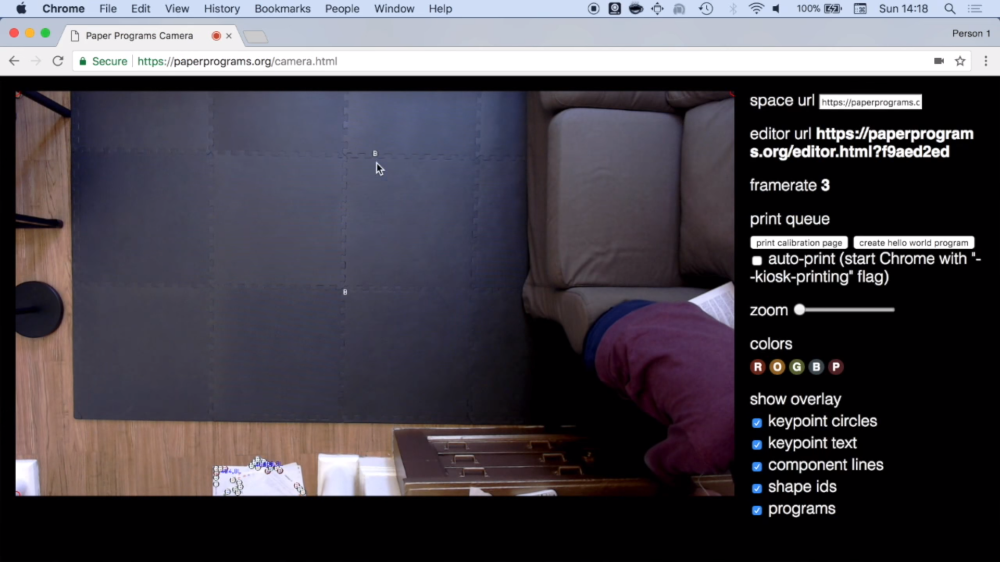
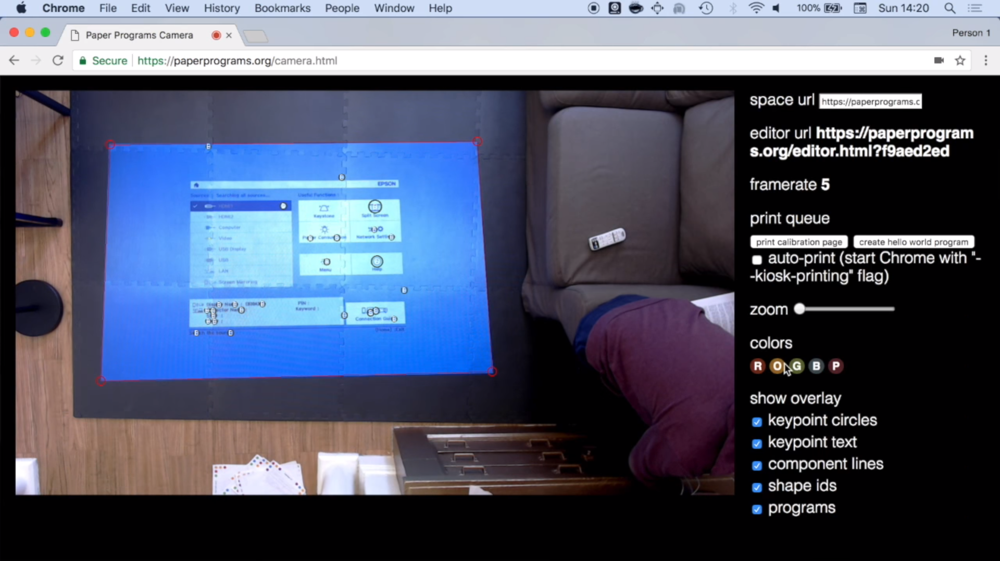
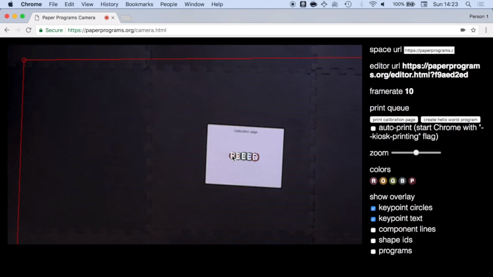

!!! warning "Under Construction" 
      
      We're currently updating our documentation. Stay tuned for more details!

## Required Hardware for Paper Control

- **Computer**: Any desktop or laptop computer should work. Performance will increase with better computer specifications (CPU, GPU, RAM, etc.). All major operating systems and browsers should also work, though most testing has been done with Windows/MacOS and Chrome/Firefox.
- **Webcam**: 720p is adequate, but be cautious with cameras having low-quality sensors, as they might not perform well under all lighting conditions.
- **Color Printer**: Alternatively, a black and white printer with colored markers will do. Check [Resources](../use/resources.md) for templates.
  - A simple piece of paper and a steady hand can also be effective! 

## Required Hardware for Projector Use

- **Projector**: Ideally, 2000 lumens and 1080p. A 1000 lumens projector might suffice in certain conditions, but the dim light required for projections might be too dark for your camera to detect programs.
- **Projector Mount**: If your projector is large, ensure the projector is secured to a load-bearing structure like a beam or stud. Command Strips or screws in drywall may not suffice. Note: You can project onto a wall and tape your programs there for a vertical setup. It is also possible to [use mirrors for an optical trick]()!
- **Optional**: Depending on your setup, you might need extended HDMI and USB cables to connect the camera and projector to the computer.
- **Optional**: A solid black rug or mat for projection. Remember, a projector's brightness is limited by its bulb, and its darkness is determined by the surface it projects onto.

## Camera Setup

An external USB webcam (at least 720p) is the best to use in order to vertically orient the webcam so you can naturally move papers around without worrying about working against gravity. Horizontal configurations are possible, especially using tape, sticky tack, or magnets (in the case of a whiteboard).

Many configurations are possible! The farther away the webcam from the surface you'll be moving the papers, the larger you will want your papers/dots to be. From a typical ceiling, you will want full letter or A5. However, from lower positions, you can scale down the papers quite successfully.

After setting up the hardware, navigate to [http://localhost:3000/camera.html](http://localhost:3000/camera.html) for camera calibration. Grant the browser permission when prompted for camera access.

Switch on your projector and project a vibrant, full-screen image. In the camera view, you'll notice 4 red circles at the corners (TL, TR, BR, BL). Drag these circles to align with the projection's corners. This helps synchronize the camera and projector views. If either the camera or projector is moved, you'll need to recalibrate.

For color calibration, print one of your paper programs and position the printed page within the projector's space. It might be easier to turn off the projector or project a black screen during this step. 

On the camera view, circles will overlay the printed ones. Calibrate each color (R, G, B, D) individually by selecting the color from the sidebar and then clicking its corresponding circle in the camera view. When selecting the color on the sidebar, the circle will highlight. The highlight will disappear when it successfully calibrates. You may need to click a few times on the circle in the Camera view depending on page performance.

Post-calibration, the sidebar colors might slightly differ, reflecting the camera's adaptation to your space's lighting. If lighting changes, recalibrate. It's important to maintain steady light conditions. Sunlight changes rapidly, especially with passing clouds! If you can, find a room with steady, uniform illumination.

## Projector Setup

Power on the projector and, using Google Chrome, access [http://localhost:3000/projector.html](http://localhost:3000/projector.html). Move this window to the projector's display and enter fullscreen mode (Ctrl/Cmd+Shift+F). If you encounter issues (e.g., a recently created program not displaying), refreshing the page should help.
