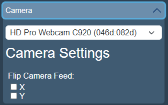
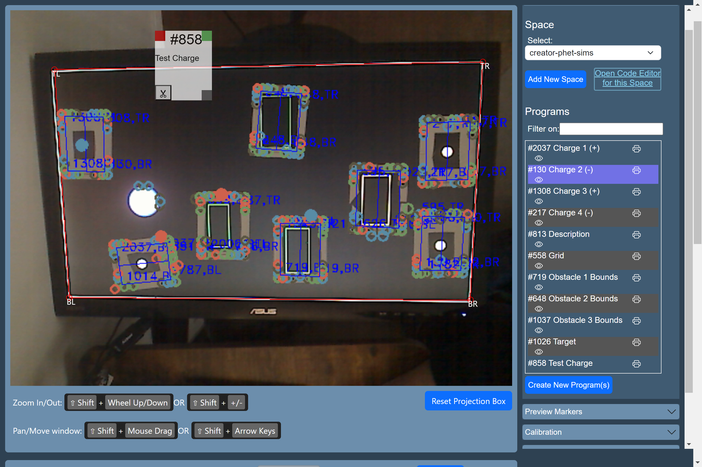
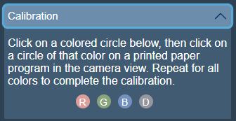
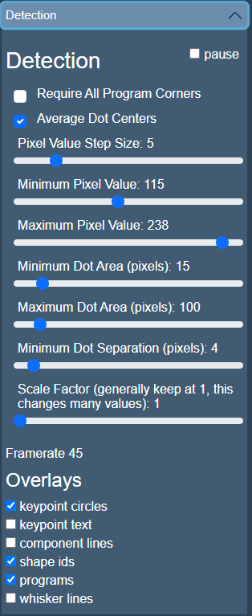

# How to set up your play area and devices

This page will guide you through setting up your devices so your computer can detect your printed paper programs and you can (optionally) project visuals onto them!

If you're already setup, then head over the [Interface Overview](../setup/interface-overview.md) for a run-down of the interface and how to get started making programs!

## *Interactive Display* Projector Setup

If you are only using the paper program detection capabilities of Paper Playground and planning to use Preview papers (eye icon next to programs in the Camera interface), skip to [Camera Setup](#camera-setup).

If you are using a projector to display visual elements in your playspace or on your paper programs, then, read on.

### Placing the projector

Find a place to place your projector that will let you move your paper programs easily in the projection space. Ideally, you are able to mount the projector above you, pointed toward the floor for the most natural interaction between the papers and anyone working with you. Webcam/projector configurations parallel to the floor (e.g., pointing at a wall) are possible, especially using tape, sticky tack, or magnets (in the case of e.g., a whiteboard).

You may later find that you need to adjust the relative positions of your projector and webcam in order to get the best program detection and most space to move papers around. See [Fine-tuning program detection](#fine-tuning-program-detection) and [Webcam tips](#webcam-optimization-tips) for more advice on improving program detection.

After powering on your projector and connecting it to your computer, open the *Display* interface (display.html) in a separate window and move it into the projector window.

Now it's time to setup your webcam.

## Camera Device Setup

### Playspace Configuration

An external USB webcam (at least 720p) is the best to use for flexibility in your paper-moving play space. Try pointing the webcam down so you can naturally move papers around without worrying about working against gravity. Webcam/projector configurations parallel to the floor (e.g., pointing at a wall) are possible, especially using tape, sticky tack, or magnets (in the case of e.g., a whiteboard).

Many configurations are possible! The farther away the webcam from the surface you'll be moving the papers, the larger you will want your papers/dots to be. You may also notice a difference in detection accuracy with higher resolution cameras (1080p and above).

!!! quote inline end ""
      

### Opening the *Camera* interface

After setting up the hardware, navigate to [http://localhost:3000/camera.html](http://localhost:3000/camera.html) for camera calibration. Grant the browser permission when prompted for camera access.

??? failure "Webcam not detected"

      If your camera is not detected or not presented as an option under the Devices header on the *Camera* page sidebar, then try checking your USB connection. If you're still having problems, it may be a permissions issue from your browser. You will need to access the site settings for localhost. This varies per browser. In Chrome, you can select the icon to the left of the URL and select "Site Settings". From there, you can navigate to Camera permissions and change it from Ask (Default) to Allowed.

### Aligning your projector to the video feed

Project any vibrant, full-screen image. The *Interactive Display* interface can work, but you will have an easier time with a bright white screen (assuming a black background).

<figure markdown>

</figure>

In the video feed, you'll notice **4 red circles** at the corners: **TL, TR, BR, BL**. Drag these circles to align with the projection's corners. If done accurately, this synchronizes the camera and projector views so that any visuals projected on the paper will properly align based on the coordinates you define in your programs.

!!! warning

      If either the camera device or projector is moved, you will need to recalibrate.

If you need to zoom in or drag the video feed to find the red circles or to help with alignment use the following key/mouse combinations:

**Zoom In/Out:** ++shift+"Wheel Up/Down"++

**Pan/Move window:** ++shift+"Mouse Drag"++

When you are ready to project, press the "Projector Mode" button on the *Interactive Display* to enlarge the display to the entire projector window. By default, the screen is black.

### Color calibrating your webcam for program detection

For color calibration, print one of your paper programs and position the printed page within the camera's view. *Note: if using the projector, it might be easier to turn off the projector or project a black screen during this step.*

<figure markdown>

</figure>

On the camera view, circles will overlay the printed ones if they are detected. Calibrate each color (R, G, B, D) individually by selecting the color from the sidebar and then clicking its corresponding circle in the video feed. When selecting the color on the sidebar, the circle will be highlighted. The highlight will disappear when it successfully calibrates. You may need to click a few times on the circle in the video feed depending on page performance.

!!! tip inline end
      Sunlight can change rapidly, especially with passing clouds! If you can, find a room with steady, uniform illumination or recalibrate frequently.

Post-calibration, the dot colors in the sidebar might slightly differ, reflecting the camera's adaptation to your space's lighting. If your lighting changes, recalibrate. It's important to maintain steady light conditions.

#### Calibrating for markers

Calibration also sets the average dot size. This will determine how large dots need to be considered "markers". If you wish to use markers in your programs, the dots will need to be 3 times larger by default.

!!! idea "Deciding on marker size"

      You can test how big your markers need to be in the camera view by bringing your paper closer to the camera which will "enlarge" your dots relative to the camera view.

### Webcam Optimization Tips

If you have control over the software of your webcam, you can optimize some parameters to help with dot/program detection. Your camera may not feature every parameter mentioned or may use different language for the same parameter.

You are looking for dots to be stably detected and might need to iteratively switch between adjusting parameters and [color calibration](device-setup.md#color-calibrating-your-webcam-for-program-detection).

We have found the following parameters to be most influential:

- TURN OFF any Auto setting for: Zoom, Exposure, White Balance
- Adjust Exposure to see papers clearly (not too dark or bright)
- Adjust: Zoom (clearest text)
- Adjust White Balance (make sure blacks look black, and not blue or green, vice versa)
- (optional) Adjust contrast
- (optional) Raise Sharpness if edges look fuzzy

### Fine-tuning program detection

If your setup is not detecting all of the dots on your papers, you will not be able to calibrate them and your programs will not be detected (or will be detected intermittently).

You can fine-tune the requirements for detecting dots on the paper for your specific setup and lighting conditions.

??? note "Directly editing detection parameters"

        If your version does not have these controls, then you can edit the following parameters (defaultParam) in the software directory: `client > camera > simpleBlobDetector.js`

        `thresholdStep` - big impact on performance, but also resolution of detection markers. It operates over min to maxThreshold.

        `minThreshold` - Not as big of an impact, but you can theoretically gate on dark background with this.

        `maxThreshold` - ^^ Likewise for very bright pixels.

        `minDistBetweenBlobs` - The number of pixels needed to call two detected centers two distinct blobs. Definitely impactful. Noisier images will benefit from this not being too small.

        `minArea` - big impact and arguably the one that made it possible for me to raise the camera much higher for detecting full sized programs. This is a parameter in detectPrograms.js as well. We should make sure they are both updated.

        `maxArea` - good for filtering out anything that is being mistreated as a marker.

Look under the Detection header in the sidebar of Camera.html and adjust the controls. Even with adjustments, you may need to improve the lighting of your room or find you need to print papers with larger dots (or more spaced out dots) to get reliable dot detection.

!!! quote inline end ""
      

- **Average Dot Centers (checkbox):** Improves performance by using an average center to determine dot position, rather than raw pixel coordinates. May decrease dot detection accuracy.
- **Pixel Value Threshold:** Changes the number of steps used to check for a difference between a dot and background. Large steps might miss dots without enough contrast, but will increase performance. Small steps will find more dots, but slow down performance significantly.
- **Min Pixel Value:** The minimum saturation value (out of 256) to look for a dot. Use this to gate out noise if image features are being detected as dots.
- **Max Pixel Value:** The maximum saturation value (out of 256) to look for  a dot. Use this to gate out noise if image features are being detected as dots.
- **Min Dot Area (pixels):** The minimum area in pixels that an image feature must be to be called a dot. Use this to gate out noise if image features are being detected as dots.
- **Max Dot Area (pixels):** The maximum area in pixels that an image feature must be to be called a dot. Use this to gate out noise if image features are being detected as dots. *This is a good slider to use if image features are being erroneously detected as Markers*.
- **Min Dot Separation (pixels):** The minimum numbers of pixels the algorithm expects to see dots. Lower values will help to detect smaller dots or farther away programs, at the cost of detecting more image features that may not be paper dots.
- **Scale Factor:** Recommended to keep at 1. Higher values lower the effective resolution of your camera feed. If you need higher performance and dot detection is not a problem/you are using a very high resolution camera, this will speed up the algorithm significantly to get more performance.

## Canvas Projector Setup

If you're using the legacy *Canvas* (projector.html) page to send visual elements to the web canvas, rather than the *Interactive Display* (display.html), you'll follow these instructions instead:

Power on the projector and separate [http://localhost:3000/projector.html](http://localhost:3000/projector.html) to its own window. Move this window to the projector's display and enter fullscreen mode (Ctrl/Cmd+Shift+F). If you encounter issues (e.g., a recently created program not displaying), refreshing the page should help.
