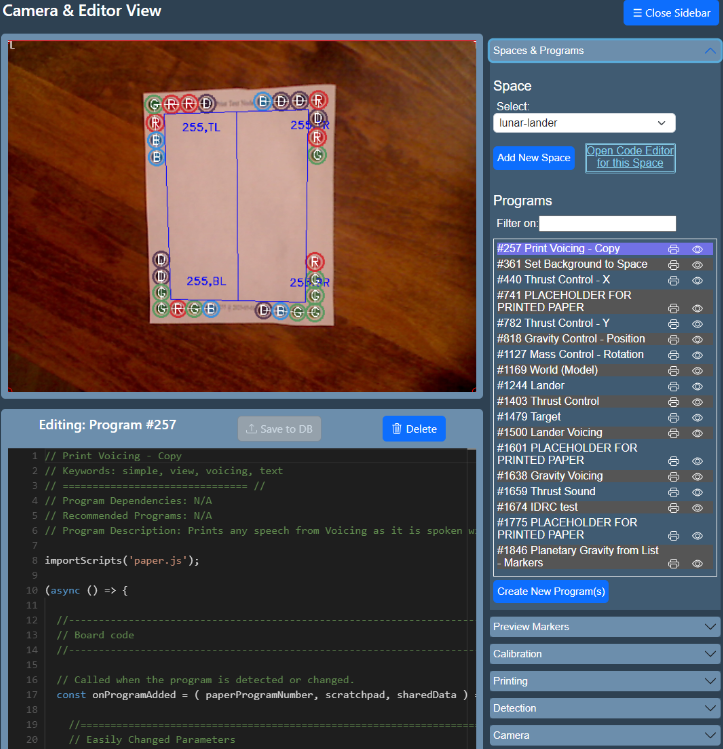
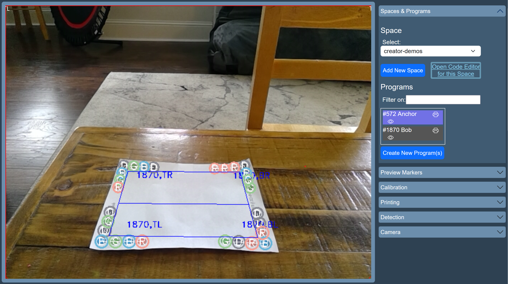
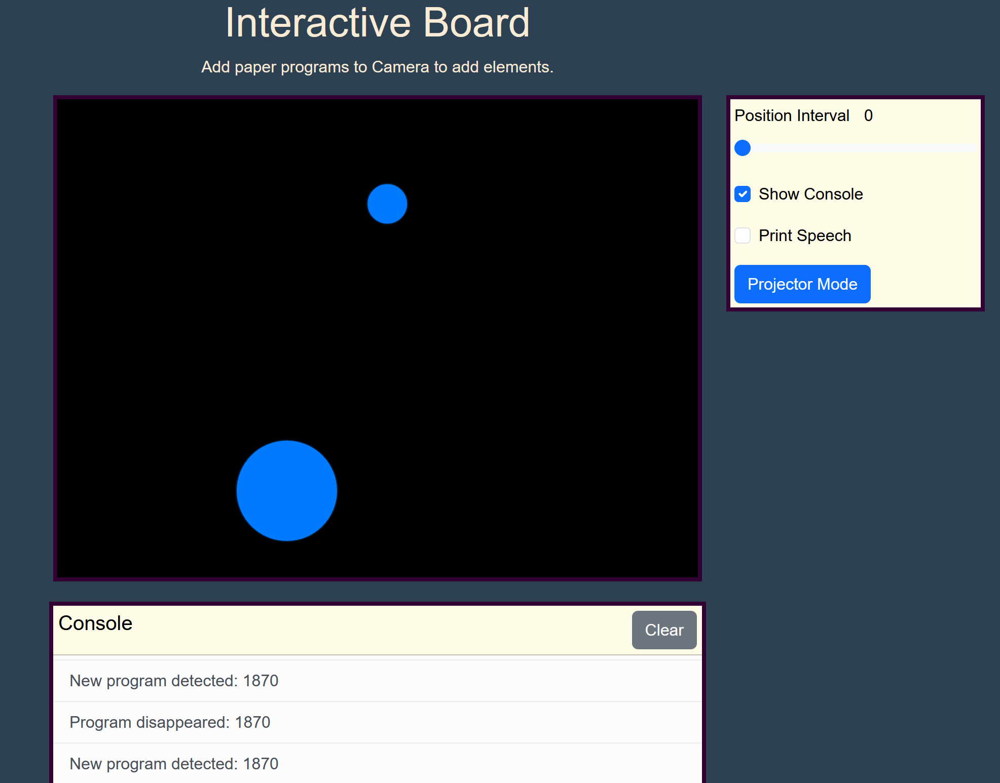
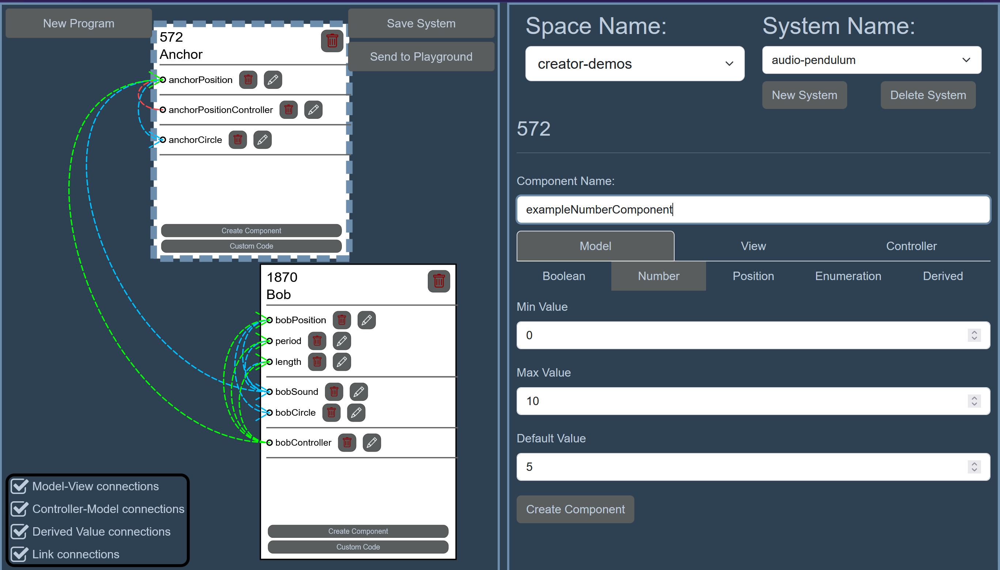
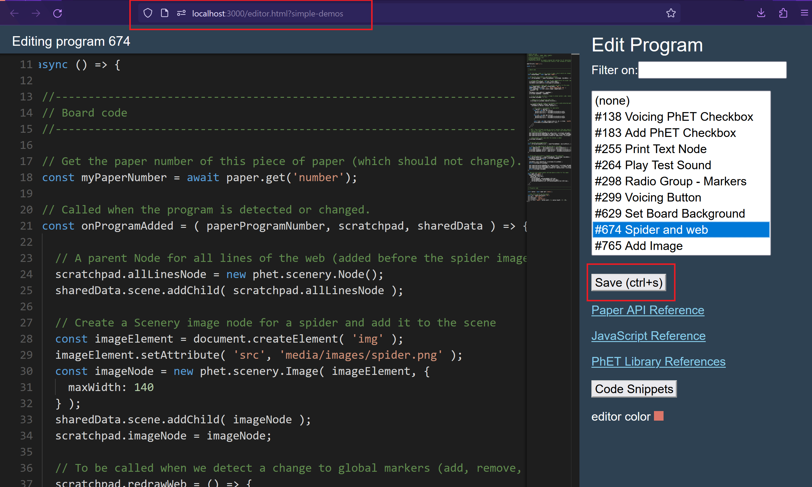

# Using Paper Playground

!!! warning "Under Construction"

      We are working on updating our documentation - more details coming soon!

<!-- https://facelessuser.github.io/pymdown-extensions/extensions/keys/#key-map-index -->

Before we begin, make sure you have [installed Paper Playground](../setup/install.md) and [set up your camera](../setup/device-setup.md).

## Interface Overview and Startup

### Step 1: Open up all pages of the interface

Navigate to localhost:3000 in your browser and either click the links or open in your browser:

1. Camera.html
2. Projector.html
3. Board.html
4. Creator.html

### What is the Camera page?

The Camera page is where all the action happens for turning your paper programs interactive!

On this page you will find the preview of your webcam, a preview of the full JavaScript for your currently selected paper program, and a plethora of options in the sidebar. Explore the headings in the sidebar to create and navigate between [spaces](#what-is-a-space), [calibrate your webcam](../setup/device-setup.md#color-calibrating-your-webcam-for-program-detection) to detect paper programs, print and [virtually preview programs and markers](#what-are-preview-papers-eye), and [fine-tune your detection](../setup/device-setup.md#fine-tuning-program-detection).

You'll use this page to match up where your papers are in space with visuals on a projector. Think of it as your play space.

#### What are Preview Papers? :eye:

If you are quickly iterating or just not in a position to print physical papers, you can still see how your code runs! Preview paper programs can be placed into the camera view at any time and the code will run as through you put a physical paper in view.

While a lot more can be done to help the preview papers mimic how you can move a physical piece of paper, there are a few features currently in place to help:

- Move the papers by dragging inside of the boundaries of the preview.
- Resize the papers by dragging an edge.
- Drag the green square to rotate the paper.
- Select the scissors to 'cut' the paper into four independently moveable corners.
  - Once cut, you can rejoin the paper with a new button.
- Preview papers can be removed at any time by selecting the red square.

!!! tip

      If you'd like to quickly clear the Preview programs, the best option currently is to refresh the Camera page.

##### Preview Markers

Just like preview papers, you can simulate physical paper markers under the Preview Markers sidebar menu. Select the eye icon to place a draggable marker into the camera view that triggers marker-related code in your paper programs.

### Organizing your code: Spaces and Projects

#### What is a Space?

A space is way of organizing your programs and how you'll locate your programs in the Camera interface to run them. Some software might refer to this as a "workspace", but we prefer to think of it as a playspace!

!!! warning

      At the time of writing, Spaces can only be created from the Camera interface ("Add New Space" button). You can select, but not create, Spaces in the Creator interface.

All of the programs in a space can be for one project or you can create a series of simpler programs that all exist in the same Space. This is completely up to you and we use them for both purposes. There is no limit to the number of Spaces you can have, so focusing each Space on one idea works well.

You might create your own personal space "my-space" :wink: and fill it with ideas you have or create a "frogger-game" space and collect all of the paper programs that will work together to create your project.

##### What is a Creator Project?

!!! info

      If you are not familiar with JavaScript development, we highly recommend you begin with the Creator interface!

When working from the Creator interface, you may notice you can create Projects after selecting space. This is one level deeper than a Space and allows you to have multiple version or different sets of programs that you can send to the selected Space in the Camera interface via the **Send to Playground** button.

!!! danger "Don't lose your programs!"

      If you select **Send to Playground** for your current project, it will OVERWRITE the programs in the Space. This introduces some incompatibility between editing programs directly in the JavaScript Editor (editor.html) and in Creator. If you only work in Creator and regularly **Save Project**, then you can always select your project and your work will be there.

     *If you'd like to directly write JavaScript and Creator, use the Custom Code button on your paper program in Creator. This code will be added to the end of each listed event function in the interface (e.g., onProgramAdded).*

### What is the Display page?

The main display! This page is where your visuals and sounds will be displayed and if you're using a projector, the page you'll want to put onto your projector to overlay visuals in your play area!

There are a few helpful additions to this page to help with your creation and play.

#### Display Controls/Features

##### Position Interval

You can adjust the sensitivity of your programs to paper movement (in the event of detection jitter) by moving the **Position Interval** slider to the right of the Board display.

!!! warning

      Keep this value as low as you can. At high values, your paper will be able to move very far without the program recognizing it has moved. Values as low as **0.1-0.2** work in many cases.

##### Print Speech

##### Show Console/Console

If you use the `phet.paperland.console.log`/`warn` functionality in any custom code section of your programs, that code will display here. See the [Paper Playground API](board-api.md/#phetpaperlandconsoleerror-args) for more information.

Regular JavaScript usage of `console.log` will display in your browser's developer console (F12 menu) as usual, but will not display in the Display Console.

### What is the Canvas page?

At this time, given the legacy structure of the client, all of the code detected in the Camera is executed through the Canvas. However, in Paper Playground, all development has been focused on paper program output sent to the Display. 

**The Canvas page must be opened to run the code, *but the tab or window does not need to be visible.***

If you would like to use vanilla Web Canvas or make use of the projection overlay feature of the legacy Paper Programs project, then this is the page where the code will output. See [https://github.com/janpaul123/paperprograms/blob/master/docs/tutorial.md](https://github.com/janpaul123/paperprograms/blob/master/docs/tutorial.md) for more on this.

## Creating and Editing Programs

### Creator: Building programs visually

See [the Creator tutorial](creator.md).

### Editor: If you're comfortable with JavaScript and reading API documents

Create new paper programs from the Camera interface (Spaces and Programs on the sidebar). You can copy an existing program from any other Space or start from a fresh template.

Once created, you can edit them in the Editor!

On the Camera interface you'll find a link to the Editor for your space (this is a good link to share with other people who are collaborating on your Space). Each space will need its own Editor window opened. You can tell which space you are in from the query parameter at the end of the Editor page URL (e.g., `../editor.html?my-space`)

Open that link (make sure you keep the Camera page open at all times) and select your Program from the list.

Make some changes in the editor (try changing what text gets drawn on the canvas for starters) and click the "save" button. The changes should now be reflected in the output of the Board or Projector pages.

When you're ready to print that program as a real piece of paper, click the Printer icon beside the program name on the Camera page. Place the newly printed paper in your webcam's view.

!!! note
      Paper Playground looks for a comment on the first line of the file and uses that as the program's name. It will use the keywords on the second line for search purposes.

At this point you should have everything you need to start building a collaborative Paper Playground "play" Space and a working interactive paper program experience! Look at the [Board API reference](../use/board-api.md) for more information about the functions available to your programs.
