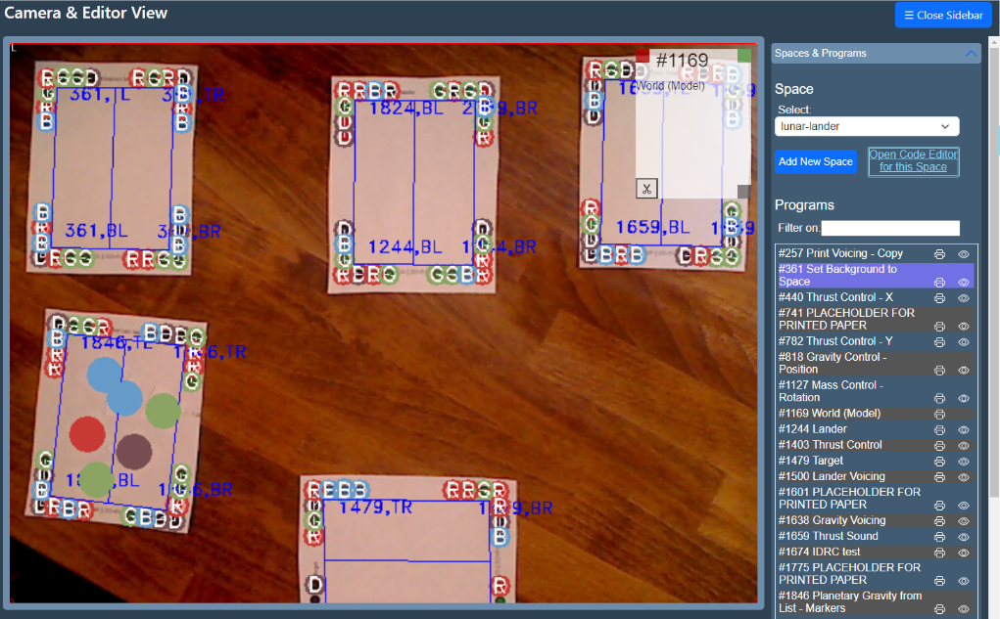

# Using Paper Playground

!!! warning "Under Construction" 
      
      We are working on updating our documentation - more details coming soon!

<!-- https://facelessuser.github.io/pymdown-extensions/extensions/keys/#key-map-index -->

Before we begin, make sure you have [installed Paper Playground](../setup/install.md) and [set up your camera](../setup/camera-tips.md).

## Step 1: Open up all pages of the interface

Navigate to localhost:3000 in your browser and either click the links or open in your browser:
1. Camera.html
2. Projector.html
3. Board.html
4. (future) Creator.html

## What is the Camera screen?

++shift+"Wheel Up/Down"++

++shift+"Mouse Drag"++

## What is the Board screen?

## What is the Projector screen?

## Printing your first program

Click the "create hello world program" button, and print the resulting program. Once it has finished printing, click "done" next to its name. Place that program somewhere in the projector's space. If you have all the overlay checkboxes checked, you should see a blue rectangle in the camera view indicating that the program has been detected. If you don't see this, it may mean some of the dots aren't being recognized and you need to try calibrating again (you may also want to adjust the lighting in the room).

The projector.html page should have the words "Hello World" and a blue dot somewhere on it.

In the real world, you should see "Hello World" and the blue dot superimposed on the paper:

You should be able to move the page and have the superimposed image move with it.

## Editing the program and creating new ones

On the camera page you'll find a link to the program editor for your space (this is a good link to share with other people who are collaborating on your space).

Open that link (make sure you keep the camera page open at all times) and select Hello World from the drop down menu. If that page is in the projector's view, it will now have a rectangular border around it that matches the "Editor color" you see on your editor page. This is a useful indicator in situations where many people have editors open simultaneously.

Make some changes in the editor (try changing what text gets drawn on the canvas for starters) and click the "save" button. The changes should now be reflected in the output of the projector.

If you want to make a new program, click "print as new paper" and place the newly printed paper in the projector's view. Also note that Paper Programs looks for a comment on the first line of the file and uses that as the program's name.

At this point you should have everything you need to build a collborative Paper Programs workspace. Look at the API reference (available on the editor page) for more information about the APIs available to your programs.